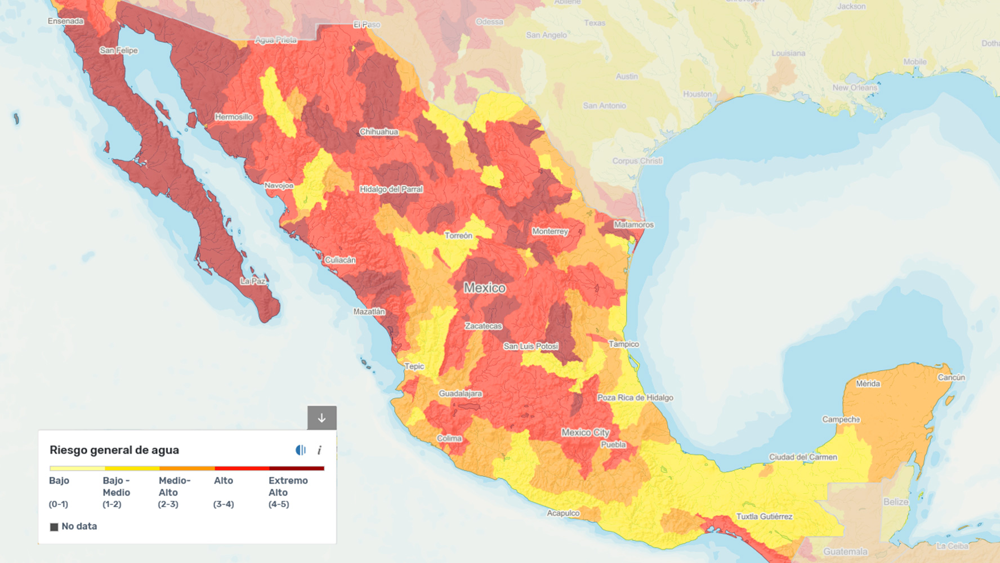

# El día cero
## ¿México sin agua? 

El Día Mundial del Agua es celebrado cada 22 de marzo, es un día para festejar la sustancia más importante en nuestras vidas y es por eso que esta fecha tiene por objetivo concientizar acerca de la crisis mundial del agua y la necesidad de buscar medidas para ahorrar.

Se menciona que el “Día Cero” está muy cerca, se le llama así cuando un lugar se va a quedar sin agua en un futuro próximo, ya sea por estrés hídrico, sobreexplotación o un mal manejo del recurso, por mencionar algunas de las causas. 

La problemática del sustento del agua en México ha sido el tema principal y la preocupación de todos los mexicanos, ya que 15 estados están a punto de quedarse sin agua, según el Instituto de Recursos Mundiales (WRI, por sus siglas en inglés) por lo que la oferta y demanda de la sustancia puede afectar no solo en la falta de agua para hacer nuestros quehaceres y aseos diarios sino en lo económico también, a esto se le llama estrés hídrico cuando la demanda de agua potable es más alta que la cantidad disponible. 

 

El agua es indispensable para sobrevivir ya que nos ayuda a mantenernos hidratados y aseados, es por eso que hay quedarnos a la tarea de cuidar esta sustancia tan importante en nuestras vidas. 

Algunos tips que todos podemos seguir para cuidar el agua:

- No riegues tus plantas o Jardín de día, ni diario.
- No uses el agua para fiestas o entretenimiento (evita llenar albercas). 
- Procura no lavar tu carro con manguera, y preferentemente no lo laves tan seguido.
- Procura bañarte en menos de cinco minutos y trata de reutilizar el agua de la ducha para regar plantas o lavar patios.
- No deseches sustancias tóxicas y aceites a las alcantarillas, inodoros y resumideros.
- Siempre verifica que todas las llaves de agua de tu casa estén bien cerradas y sin ninguna gotera.
- Al lavar la ropa haz cargas completas.
- Has un chequeo semanal o quincenal en las tuberías para verificar que no tengas alguna fuga.

Ayuda a que el “Día Cero” no llegue al país, siguiendo a pie de la letra estos tips, porque todos podemos llegar a ser el cambio, cuida el agua, cuida al mundo, y sobre todo cuídate tú. 

Del Toro, E. *"¿México sin agua? Esto debes saber para evitar el día cero"* (Sitio web). Marzo 23, 2021. El Occidental. <https://www.eloccidental.com.mx/local/noticias-mexico-sin-agua-esto-debes-saber-para-evitar-el-dia-cero-6511115.html> (Marzo 25, 2021). 